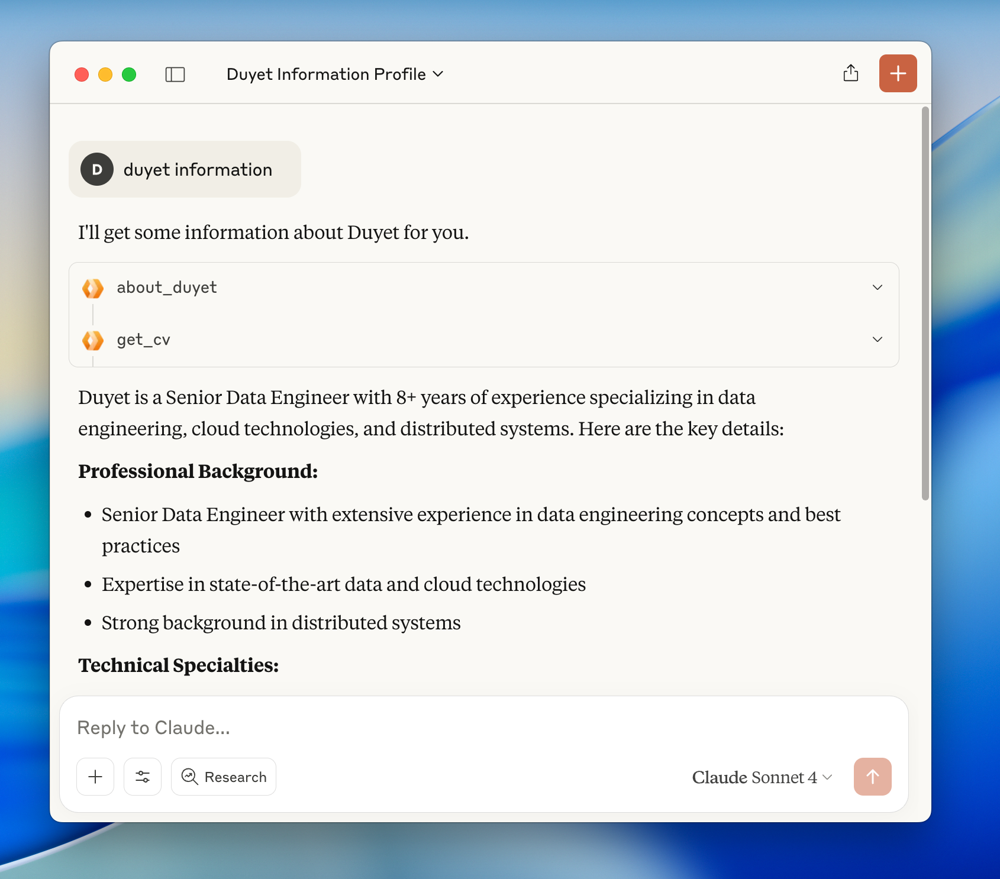
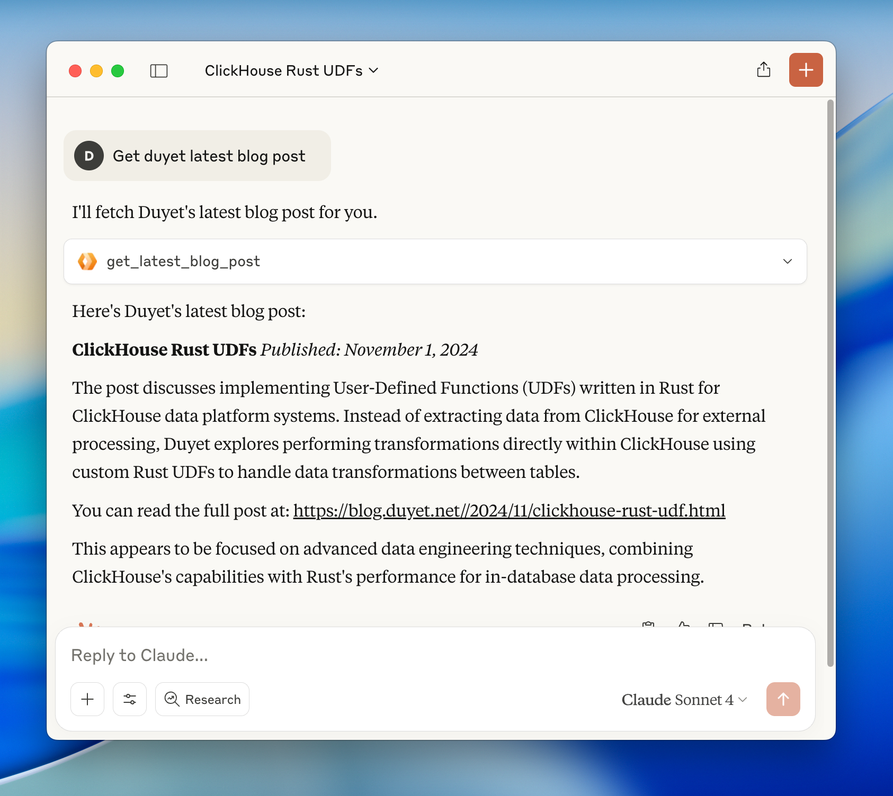
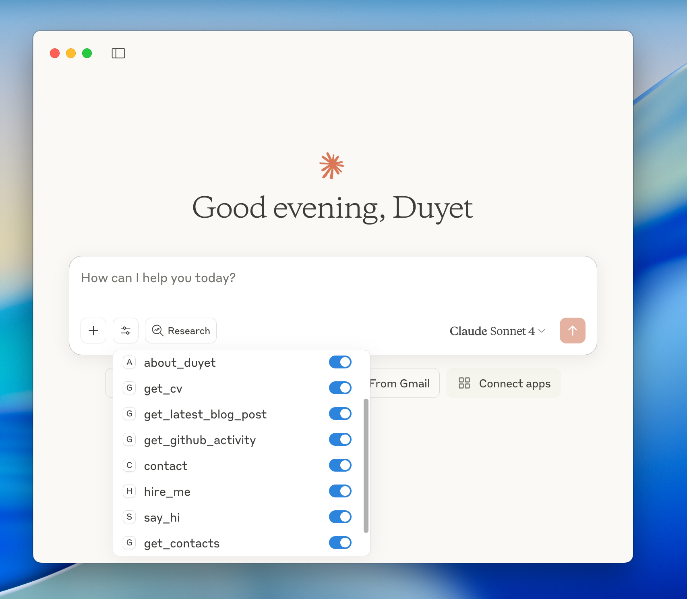
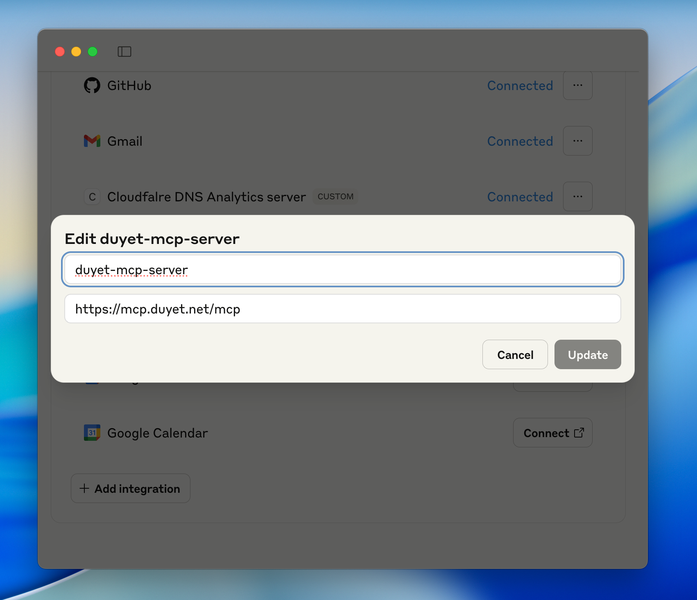
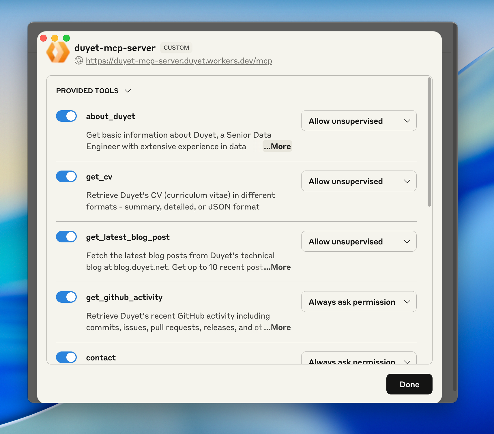
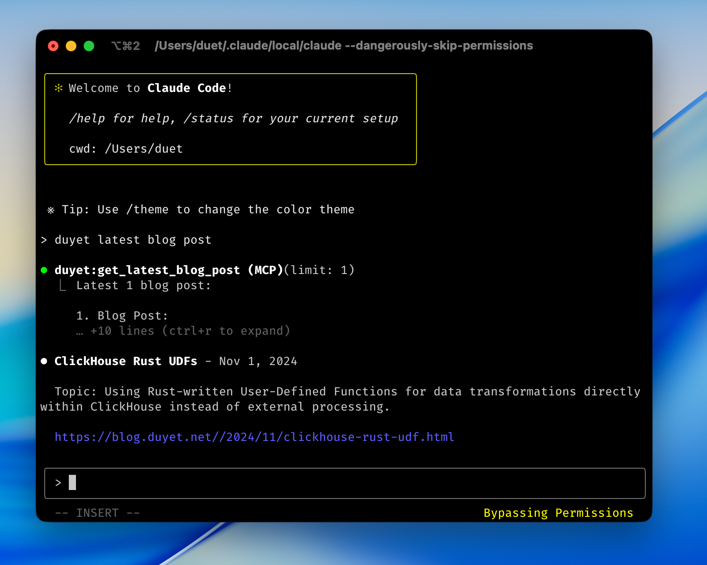

# duyet-mcp-server

[](https://github.com/duyet/duyet-mcp-server/actions)
[](https://codecov.io/gh/duyet/duyet-mcp-server)
[](https://github.com/duyet/duyet-mcp-server/actions)

An experimental [MCP (Model Context Protocol)](https://modelcontextprotocol.io) server that helps AI assistants connect to and retrieve information about duyet. This server provides access to information primarily available at [https://duyet.net](https://duyet.net), making it available directly to your AI assistant.

Usage: Update MCP server configuration in your AI assistant:

```json
{
  "mcpServers": {
    "duyet-mcp-server": {
      "command": "npx",
      "args": [
        "mcp-remote",
        "https://mcp.duyet.net/sse"
      ]
    }
  }
}
```

If you are using Claude Code:

```bash
claude mcp add --transport http duyet https://mcp.duyet.net/mcp
```

Endpoints:
- https://mcp.duyet.net/sse
- https://mcp.duyet.net/mcp








## About This Project

This is a **study, demo, and experimental project** designed to explore MCP capabilities. The project serves as a learning exercise in building remote MCP servers and is mostly written by LLM as well.

**Purpose**: Enable AI assistants to access and retrieve information about duyet's work, projects, and content that would otherwise require manual web browsing.

## Deploy to Cloudflare Workers

[](https://deploy.workers.cloudflare.com/?url=https://github.com/duyet/duyet-mcp-server)

This will deploy your MCP server to a URL like: `duyet-mcp-server.<your-account>.workers.dev/sse`


Alternatively, you can clone and deploy using the command line:

```bash
git clone https://github.com/duyet/duyet-mcp-server
cd duyet-mcp-server
npm install
npm run deploy
```

## Customizing Your MCP Server

To add your own [tools](https://developers.cloudflare.com/agents/model-context-protocol/tools/) to the MCP server, define each tool inside the `init()` method of `src/index.ts` using `this.server.tool(...)`. 

### Connect to Cloudflare AI Playground

You can test your MCP server using the Cloudflare AI Playground:

1. Go to https://playground.ai.cloudflare.com/
2. Enter your deployed MCP server URL (`duyet-mcp-server.<your-account>.workers.dev/sse` or `duyet-mcp-server.<your-account>.workers.dev/mcp`)
3. You can now use the duyet information tools directly from the playground!

### Connect Claude Desktop to Your MCP Server

You can connect to your remote MCP server from Claude Desktop using the [mcp-remote proxy](https://www.npmjs.com/package/mcp-remote). 

To connect from Claude Desktop, follow [Anthropic's Quickstart](https://modelcontextprotocol.io/quickstart/user) and go to Settings > Developer > Edit Config.

Update with this configuration:

```json
{
  "mcpServers": {
    "duyet-info": {
      "command": "npx",
      "args": [
        "mcp-remote",
        "https://duyet-mcp-server.<your-account>.workers.dev/sse"
      ]
    }
  }
}
```

You should see the duyet-mcp information tools become available.

# Available Resources and Tools

This MCP server exposes both **Resources** (read-only data access via URIs) and **Tools** (interactive functions with parameters). Resources are automatically discovered by Claude Chat for natural conversation flow, while tools are used for actions that require user input.

## Resources
Resources provide read-only access to information through URI-based requests. These are automatically discoverable by Claude Chat.

### Core Information Resources
- **`duyet://about`** - Basic information about Duyet with dynamically calculated years of experience
- **`duyet://cv/{format}`** - CV/resume with format parameters:
  - `duyet://cv/summary` - Brief CV overview
  - `duyet://cv/detailed` - Comprehensive CV information  
  - `duyet://cv/json` - Structured CV data (when available)

### Content Resources
- **`duyet://blog/posts/{limit}`** - Latest blog posts from Duyet's technical blog
  - `duyet://blog/posts/1` - Latest blog post
  - `duyet://blog/posts/5` - Latest 5 blog posts (limit: 1-10)
- **`duyet://github-activity`** - Recent GitHub contributions and activity

## Tools
Tools provide interactive functionality with input parameters and side effects.

- **`send_message`** - Send a message to Duyet for collaboration, job opportunities, consulting, or general inquiries. Messages are saved with a reference ID for follow-up
- **`get_cv`** - Retrieve Duyet's CV (curriculum vitae) in different formats - summary, detailed, or JSON format
- **`get_github_activity`** - Retrieve Duyet's recent GitHub activity including commits, issues, pull requests, releases, and other public events. View up to 20 recent activities with optional detailed information
- **`hire_me`** - Get information about hiring Duyet for various roles - full-time, contract, consulting, or part-time positions. Includes expertise, experience, and next steps
- **`say_hi`** - Send a friendly greeting to Duyet with an optional personal message. Get contact information and connection links
- **`contact_analytics`** - Generate analytics reports on contact submissions including summary statistics, purpose breakdown, daily trends, and recent activity patterns

## Claude Chat Examples

Here are examples of natural conversation flows using this MCP server:

### Learning About Duyet

```
User: Who is Duyet and what does he do?

Claude: [Automatically accesses duyet://about resource]
Duyet is a Data Engineer with 8 years of experience. He is confident in his knowledge of Data Engineering concepts, best practices and state-of-the-art data and Cloud technologies. You can check out his blog at https://blog.duyet.net, his CV at https://duyet.net/cv, and his projects at https://github.com/duyet.

User: What has he been writing about lately?

Claude: [Automatically accesses duyet://blog/posts/3 resource]  
His latest blog posts include topics on data engineering, cloud technologies, and distributed systems. Would you like me to show you more details about any specific post?

User: What's he working on currently?

Claude: [Automatically accesses duyet://github-activity resource]
Based on his recent GitHub activity, Duyet has been working on MCP server implementations, data pipeline projects, and contributing to open source tools for data engineering.
```

### Hiring and Collaboration

```
User: I'm looking to hire a data engineer. Can you help me contact Duyet?

Claude: I can help you send a message to Duyet using the send_message tool. What type of opportunity is this?

User: It's a full-time position at our startup working with Kafka and Spark

Claude: [Uses send_message tool]
What would you like to say in your message to Duyet? I'll make sure to include that this is about a full-time position with Kafka and Spark technologies.

User: Hi Duyet, we're a Series A startup building real-time data platforms. We'd love to discuss a Senior Data Engineer role working with Kafka, Spark, and cloud infrastructure. Remote-friendly position with competitive equity.

Claude: [Executes send_message tool with the message]
Your message has been sent successfully! Here's your reference ID: abc-123-def for follow-up. Duyet can be reached directly at me@duyet.net, LinkedIn: https://linkedin.com/in/duyet, or GitHub: https://github.com/duyet.
```

### Technical Research

```
User: I want to understand Duyet's technical background before our interview

Claude: [Automatically accesses duyet://cv/detailed resource]
Based on Duyet's detailed CV, he has 8 years of experience in data engineering with expertise in Apache Spark, Kafka, cloud platforms, and distributed systems. His experience includes building scalable data pipelines and working with modern data stack technologies.

User: Can you show me some of his recent technical work?

Claude: [Automatically accesses duyet://github-activity resource]
His recent GitHub activity shows contributions to data engineering projects, MCP server implementations, and open source tools. He's been actively working on distributed systems and cloud-native data solutions.

User: What kind of content does he write about?

Claude: [Automatically accesses duyet://blog/posts/5 resource]
His technical blog covers topics like building scalable data pipelines, modern data engineering best practices, cloud technologies, and distributed systems architecture.
```

## Natural Discovery Pattern

The key advantage of this MCP server design is that Claude Chat can naturally discover and reference information through resources, making conversations more fluid:

1. **Information Questions** → **Automatic Resource Access**
   - "Who is Duyet?" → `duyet://about`
   - "What's his experience?" → `duyet://cv/detailed`
   - "What's he writing about?" → `duyet://blog/posts/3`
   - "What's he working on?" → `duyet://github-activity`

2. **Action Requests** → **Interactive Tools**
   - "I want to contact him" → `send_message` tool
   - "Can you send him a greeting?" → `say_hi` tool
   - "Get his resume" → `get_cv` tool

3. **Progressive Disclosure**
   - Start with general questions
   - Drill down into specific areas
   - Take actions when ready


## Architecture

- **Framework**: Hono.js running on Cloudflare Workers
- **Database**: Cloudflare D1 with Drizzle ORM
- **Testing**: Jest with comprehensive test coverage
- **Linting**: Biome for code quality
- **Type Safety**: TypeScript with strict configuration

## License

MIT License - see LICENSE file for details.
